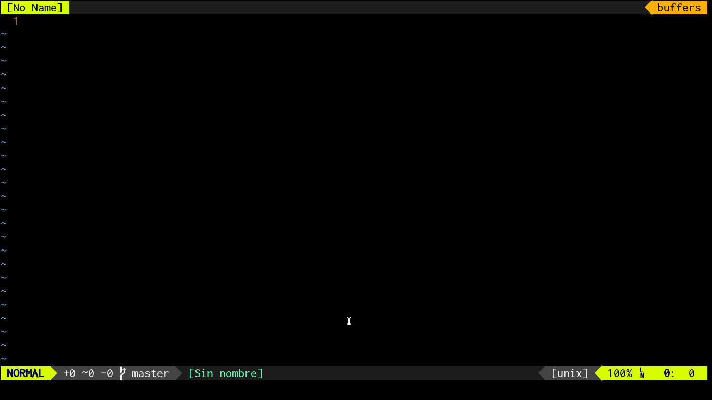

# ag.vim #
[](https://travis-ci.org/albfan/ag.vim)

This plugin is a front for ag, A.K.A.
[the_silver_searcher](https://github.com/ggreer/the_silver_searcher).  Ag can
be used as a replacement for 153% of the uses of `ack`.  This plugin will allow
you to run ag from vim, and shows the results in a split window.

## Installation ##

See [the_silver_searcher's README](https://github.com/ggreer/the_silver_searcher#installing) for its installation instructions (if you haven't installed it already).

You have to first install [ag](https://github.com/ggreer/the_silver_searcher), itself. On Mac+Homebrew, Gentoo Linux, several others, there's package named `the_silver_searcher`, but if your OS/distro don't have one, the GitHub repo installs fine:

Vim has various ways of installing plugins, the standard way is in [the documentation](http://vimdoc.sourceforge.net/htmldoc/usr_05.html#plugin), but most people use a plugin to manage their plugins. If you don't already have a preferred plugin manager plugin, why not try one of the following?
- [vim-plug](https://github.com/junegunn/vim-plug#readme)
- [vim-pathogen](https://github.com/tpope/vim-pathogen#readme)
- [Vundle.vim](https://github.com/gmarik/Vundle.vim#readme)
- Or, if you don't use any sort of Vim plugin management:

  ```sh
  cd ~/.vim/bundle && git clone https://github.com/rking/ag.vim ag && echo "set runtimepath^=~/.vim/bundle/ag" >> ~/.vimrc
  ```

  Then open vim and run `:helptags ~/.vim/bundle/ag/doc`.

### Configuration ###

You can specify a custom ag name and path in your .vimrc like so:

    let g:agprg="<custom-ag-path-goes-here> --vimgrep"

You can configure ag.vim to always start searching from your project root
instead of the cwd

    let g:ag_working_path_mode="r"

## Usage ##

    :Ag [options] {pattern} [{directory}]

Search recursively in {directory} (which defaults to the current directory) for the {pattern}.

Files containing the search term will be listed in the split window, along with
the line number of the occurrence, once for each occurrence.  [Enter] on a line
in this window will open the file, and place the cursor on the matching line.

Just like where you use :grep, :grepadd, :lgrep, and :lgrepadd, you can use `:Ag`, `:AgAdd`, `:LAg`, and `:LAgAdd` respectively. (See `doc/ag.txt`, or install and `:h Ag` for more information.)

## Shell mimic ##

For those who like how ag performs on shell use 

    :[N]AgGroup {pattern} [{directory}]

see this screencast



### Gotchas ###

Some characters have special meaning, and need to be escaped your search pattern. For instance, '#'. You have to escape it like this `:Ag '\\\#define foo'` to search for `#define foo`. (From [blueyed in issue #5](https://github.com/mileszs/ack.vim/issues/5).)

Sometimes `git grep` is even faster, though in my experience it's not noticeably so.

### Keyboard Shortcuts ###

In any window you can issue

    <Leader>ag to search word under cursor, or visual selection

In the quickfix window, you can use:

    e    to open file and close the quickfix window
    o    to open (same as enter)
    go   to preview file (open but maintain focus on ag.vim results)
    t    to open in new tab
    T    to open in new tab silently
    h    to open in horizontal split
    H    to open in horizontal split silently
    v    to open in vertical split
    gv   to open in vertical split silently
    q    to close the quickfix window

### Acknowledgements ###

This Vim plugin is derived (and by derived, I mean copied, almost entirely)
from [milesz's ack.vim](https://github.com/mileszs/ack.vim), which I also
recommend installing since you might be in a situation where you have ack but
not ag, and don't want to stop to install ag. Also, ack supports `--type`, and
a few other features.
